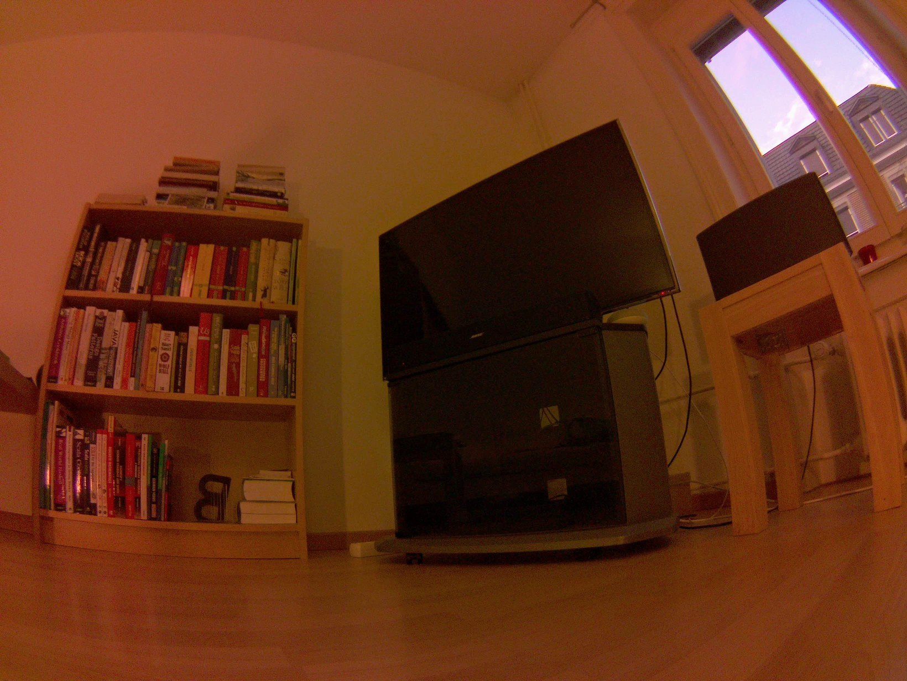
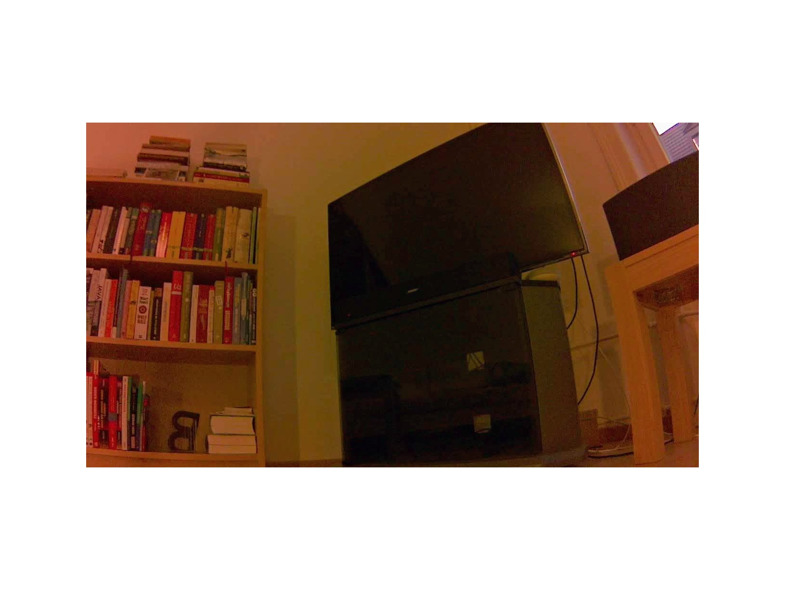

GStreamer on the Nano
=====================

Getting started with using GStreamer with the Raspberry Pi camera module V2 with a Raspberry Pi rather than a Jetson Nano is covered in [`pi-camera-notes.md`](pi-camera-notes.md).

---

    $ sudo apt install v4l-utils
    $ v4l2-ctl --list-formats-ext

Nvidia has optimized versions of various GStreamer elements - use them in preference to the equivalent standard elements:

    $ gst-inspect-1.0 | egrep '^nv'
    $ gst-inspect-1.0 | egrep '^omx'

E.g. use `omxh264enc` rather than `x264enc`.

Basic H.264 steaming
--------------------

On the Nano:

    $ gst-launch-1.0 nvarguscamerasrc ! 'video/x-raw(memory:NVMM), width=3280, height=2464' ! nvvidconv ! omxh264enc ! h264parse ! rtph264pay config-interval=1 pt=96 ! gdppay ! tcpserversink host=0.0.0.0 port=9090

On your local machine:

    $ gst-launch-1.0 -v tcpclientsrc host=jetsonnano.local port=9090 ! gdpdepay ! rtph264depay ! avdec_h264 ! videoconvert ! autovideosink sync=false

Most useful page so far - the RidgeRun page of using [GStreamer with the Jetson TX1](https://developer.ridgerun.com/wiki/index.php?title=Gstreamer_pipelines_for_Jetson_TX1).

There's a near identical [page](https://developer.ridgerun.com/wiki/index.php?title=Gstreamer_pipelines_for_Jetson_TX2) for the TX2. The two have diverged slightly - the TX1 page seems to have more reference links - the only section that the TX2 page has that the TX1 doesn't is the short piece on using VLC in the [H264 UDP streaming section](https://developer.ridgerun.com/wiki/index.php?title=Gstreamer_pipelines_for_Jetson_TX2#H264_UDP_Streaming).

Next steps
----------

You can interogate elements like `nvarguscamerasrc` for their capabilities and other information:

    $ gst-inspect-1.0 nvarguscamerasrc

On the Nano with the Pi camera module just `video/x-raw(memory:NVMM)` and you can set `width`, `height` and `framerate` (along with various properties like `do-timestamp` and `wbmode`).

On launching a pipeline that uses `nvarguscamerasrc`, the log output shows the available mode:

    GST_ARGUS: Available Sensor modes :
    GST_ARGUS: 3280 x 2464 FR = 21.000000 fps ...
    GST_ARGUS: 3280 x 1848 FR = 28.000001 fps ...
    GST_ARGUS: 1920 x 1080 FR = 29.999999 fps ...
    GST_ARGUS: 1280 x 720 FR = 59.999999 fps ...
    GST_ARGUS: 1280 x 720 FR = 120.000005 fps ...

You don't seem to be able to select a mode directly, instead it's inferred from the `width`, `height` and `framerate`. So to capture an image in each mode I did:

    $ gst-launch-1.0 nvarguscamerasrc num-buffers=1 ! 'video/x-raw(memory:NVMM), width=3280, height=2464' ! nvjpegenc ! filesink location=mode-0.jpg
    $ gst-launch-1.0 nvarguscamerasrc num-buffers=1 ! 'video/x-raw(memory:NVMM), width=3280, height=1848, framerate=28/1' ! nvjpegenc ! filesink location=mode-1.jpg
    $ gst-launch-1.0 nvarguscamerasrc num-buffers=1 ! 'video/x-raw(memory:NVMM), width=1920, height=1080' ! nvjpegenc ! filesink location=mode-2.jpg
    $ gst-launch-1.0 nvarguscamerasrc num-buffers=1 ! 'video/x-raw(memory:NVMM), width=1280, height=720' ! nvjpegenc ! filesink location=mode-4.jpg

You can check the mode selected by looking at the log output, e.g.:

    GST_ARGUS: Running with following settings:
       Camera index = 0
       Camera mode  = 4
       Output Stream W = 1280 H = 720
       seconds to Run    = 0
       Frame Rate = 120.000005

Oddly I had to specify `framerate` for mode 1 or else it would select mode 0, despite specifying the mode 1 specific `height` value. And I couldn't find anyway to get `nvarguscamerasrc` to select mode 3, no matter what I set the framerate to.

Nvidia provide a tool called `nvgstcapture-1.0` that's supposed to make it easier to construct a basic pipeline for video or still capture. E.g. to capture a single image to a file:

    $ nvgstcapture-1.0 --mode=1 --image-res=3 --automate --capture-auto=1

The image ends up in a file prefixed with `nvcamtest`, e.g. `nvcamtest_10494_s00_00000.jpg` (what the digits etc. signify, I don't know) - for no obvious reason there's a noticeable delay before the image capture occurs.

For more information see:

    $ nvgstcapture-1.0 --help

Overall there seems to be no real benefit over calling `gst-launch-1.0` directly.

Note: I wasn't able to work out any way to select camera mode 3 using `gst-launch-1.0` directly nor when using `nvgstcapture-1.0`.

Field of view
-------------

One of the surprising and very important things is that `height` and `width` aren't about determining the scale of the image _after_ it's been captured - they actually influence how much of the sensor is used.

It's worth capturing the same scene using the four modes above, i.e. 0, 1, 2 and 4, and then comparing the resulting images. The mode 4 image isn't simply the same as mode 0 but scaled to 1280x720 - it's actually captured a dramatically smaller area of the actual scene.

You can see more clearly what's happening by looking a the FoV image for the V2 camera in the [Picamera camera modes documentaton](https://picamera.readthedocs.io/en/release-1.12/fov.html#camera-modes) - look for the second image of a street scene (the first is for the old V1 camera).

Note that the mode numbers used in the Raspberry Pi world _don't_ correspond to those used by `nvarguscamerasrc`.

So for `nvarguscamerasrc`:

* Mode 0 - 3280x2464 - uses the full sensor.
* Mode 1 - 3280x1848 (framerate=28/1) - uses the full width of the sensor but clips off the top and bottom.
* Mode 2 - 1920x1080 - uses just the center of the sensor.
* Mode 3 - 1280x720 - uses a larger area of the sensor than mode 2 but still clips off some of the top, bottom, left and right.

So mode 0 uses the full sensor while mode 2 uses only about a quarter of it.

Taking four images, `mode-0.jpg`, `mode-1.jpg`, `mode-2.jpg` and `mode-4.jpg`, captured as above with `gst-launch-1.0`, you can scale and add borders like so (with ImageMagick) to make it clearer how much of the sensor is being used in each mode:

    $ convert mode-0.jpg -resize 50% cmp-mode-0.jpg
    $ convert mode-1.jpg -resize 50% mode-1-0.5.jpg
    $ convert mode-2.jpg -resize 50% mode-2-0.5.jpg
    $ convert mode-1-0.5.jpg -gravity center -extent 1640x1232 cmp-mode-1.jpg
    $ convert mode-2-0.5.jpg -gravity center -extent 1640x1232 cmp-mode-2.jpg
    $ convert mode-4.jpg -gravity center -extent 1640x1232 cmp-mode-4.jpg

This produces a set of images, `cmp-mode-0.jpg`, `cmp-mode-1.jpg`, `cmp-mode-2.jpg` and `cmp-mode-4.jpg` like the following:

| Mode 0 | Mode 1 | Mode 2 | Mode 4 |
|--------|--------|--------|--------|
|  |  |  |  |

For still images it's hard to see why you'd ever use anything other than mode 0. For video the FPS rate of the different modes becomes an issue - although here it's hard to see why one would ever use mode 2 - it uses a smaller area of the sensor than mode 4 and can only achieve a FPS that's a quarter of that of mode 4. Mode 4 uses binning (2x2 pixels become 1 pixel in the output image) whereas mode 2 captures at native resolution - however even this doesn't weigh in mode 2's favor - binning is generally seen as advantageous as it reduces sensor noise (which becomes more apparent in low light situations).

**Update:** when capturing still images using mode 2 and mode 4, those captured using mode 4 do look more grainy - so perhaps the 120 FPS or mode 4 (vs the 30 FPS of mode 2) comes into play even for still images and affects the amount of time the sensor is exposed to light (I would have imagined FPS was only a factor for video capture - but maybe still images are simply equivalent to a video consisting of a single frame).

So when working through any machine vision projects and using image capture code written by someone else it's worth first starting up video streaming, as up above, in mode 0, and comparing what you see with what the image capture code you're using sees. The original author may have inadvertently selected parameters that result in a less than ideal mode, like mode 2, being selected.

GStreamer basics
----------------

Introduction to the GStreamer tools - <https://gstreamer.freedesktop.org/documentation/tutorials/basic/gstreamer-tools.html>

When looking at GStreamer examples it was obvious that a pipeline of tools (called elements) were involved but I didn't understand the bits that seem to be just text strings:

    $ gst-launch-1.0 nvcamerasrc ! 'video/x-raw(memory:NVMM), width=1920, height=1080, format=I420, framerate=60/1' ! nvvidconv ! 'video/x-raw(memory:NVMM), format=I420' ! nvoverlaysink -e

I.e. the bits like `'video/x-raw(memory:NVMM), ...'` - these are [caps filters](https://gstreamer.freedesktop.org/documentation/tutorials/basic/gstreamer-tools.html#caps-filters).

According to the documentation you can achieve the same with [named pads](https://gstreamer.freedesktop.org/documentation/tutorials/basic/gstreamer-tools.html#pads).

TODO: see if named pads allow for simpler specification of what you want, i.e. use `gst-inspect-1.0` to find out the named pads supported by e.g. `nvcamerasrc` and use one of these rather than a big long string.

Elements have capabilities - see <https://gstreamer.freedesktop.org/documentation/tutorials/basic/media-formats-and-pad-capabilities.html>

Elements in a pipeline can produce a whole load of outputs and accept a whole load of inputs - to see an element's sink and source cap(abilities) do:

    $ gst-inspect-1.0 videotestsrc
    $ gst-inspect-1.0 videoconvert

The process by which each of the elements decide on the formats to be used is called caps negotiation - negotiation is covered in a [design section](https://gstreamer.freedesktop.org/documentation/design/negotiation.html) and in a [development section](https://gstreamer.freedesktop.org/documentation/plugin-development/advanced/negotiation.html).

Taking this pipeline:

    $ gst-launch-1.0 videotestsrc ! videoconvert ! autovideosink

Each element supports various capabilities with XXX (what's the name for `format`, `width` etc? Properties?) that can take many values.

It would be interesting to know how exactly the above pipeline settles on:

    video/x-raw, width=320, height=240, framerate=30/1, format=YUY2, pixel-aspect-ratio=1/1, interlace-mode=progressive

You can see the process and what's settled on with `gst-launch-1.0 -v`.

TODO: what is `-v` actually showing - it doesn't look much like negotiation but it looks like more than just a dump of final choices.

You can get some insight into the process with [pipeline graphs](https://gstreamer.freedesktop.org/documentation/tutorials/basic/debugging-tools.html#getting-pipeline-graphs).

Generate a series of graphs:

    $ mkdir dots
    $ export GST_DEBUG_DUMP_DOT_DIR=$PWD/dots
    $ gst-launch-1.0 videotestsrc ! videoconvert ! autovideosink

Kill `gst-launch` and look at the graphs use `xdot`:

    $ sudo apt install xdot
    $ for file in dots/*; do xdot $file; done

Xdot doesn't have much in the way of a user interface - the author also suggests ZGRViewer in the [links section](https://github.com/jrfonseca/xdot.py#links) of the xdot github page, ZGRViewer is a moribund project (unlike xdot which is actively developed) that provides a Java viewer, that still works fine despite no updates since 2015. While _looking_ far fancier it doesn't seem to offer any additional features over xdot when it comes to the pipeline graphs and for this situation is actually less convenient to use.

Miscellaneous
-------------

Intro the GStreamer and Jetson by Peter Moran - <http://petermoran.org/csi-cameras-on-tx2/>

---

JetsonHacks has a nice simple [github repo](https://github.com/JetsonHacksNano/CSI-Camera) for getting started with a CSI camera on the Nano.

TODO: this repo uses the element `nvarguscamerasrc` while other pages (including Peter Moran) use `nvcamerasrc` - what's the difference? And how's it different to using `v4l2src device=/dev/video0` - you can see `v4l2src` and `nvcamerasrc` being used [here](https://devtalk.nvidia.com/default/topic/1037844/jetson-tx2/capture-raw-video-through-gstreamer-with-csi-cameras/) to achieve the same affect with a Jetson TX2.

---

Peter Moran's page links to the eLinux Jetson/Cameras [wiki page](https://elinux.org/Jetson/Cameras) which keeps track of supported cameras - for CSI cameras for the Nano it's basically just:

* The Raspberry Pi V2 camera module - $25
* The Leopard Imaging [LI-IMX219-MIPI-FF-NANO](https://leopardimaging.com/product/li-imx219-mipi-ff-nano/) - $29
* The e-Con systems [e-CAM30_CUNANO](https://www.e-consystems.com/nvidia-cameras/jetson-nano-cameras/3mp-mipi-camera.asp) - US$79

---

Nvidia [L4T accelerated GStreamer user guide 32.1](https://developer.nvidia.com/embedded/dlc/l4t-accelerated-gstreamer-guide-32-1) (you can find the most recent version at the [downloads center](https://developer.nvidia.com/embedded/downloads) - remember to sort the list there by version number rather than release date as the version numbers, for this document, are tied to JetPack versions and sometimes the release updates for older versions of JetPack).
