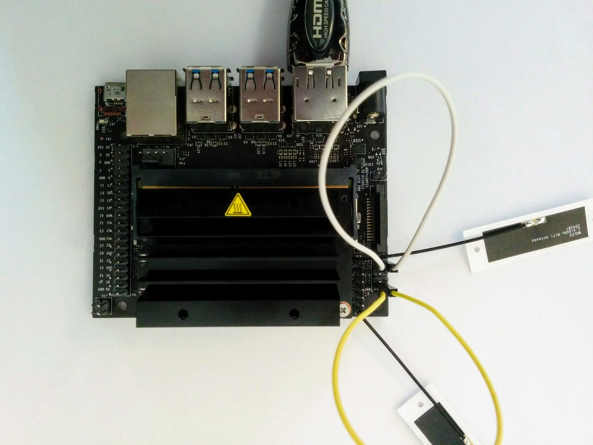
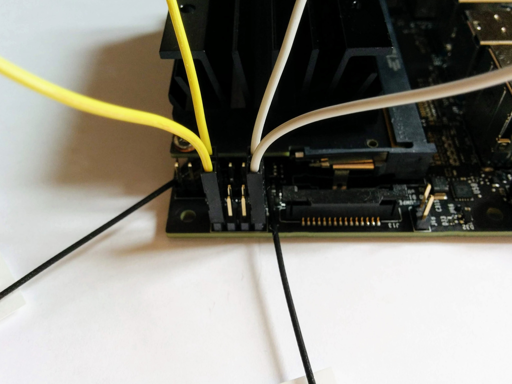
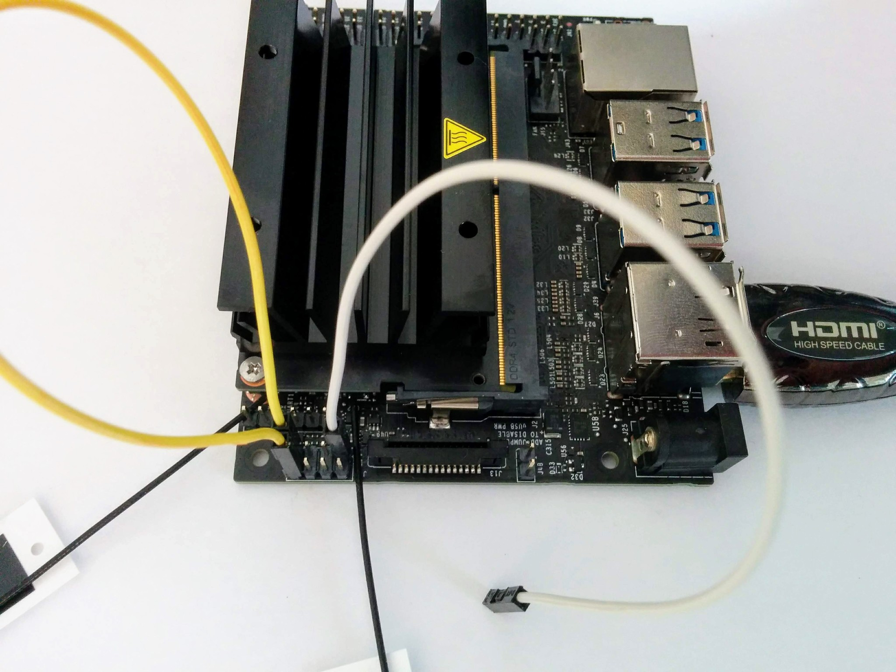
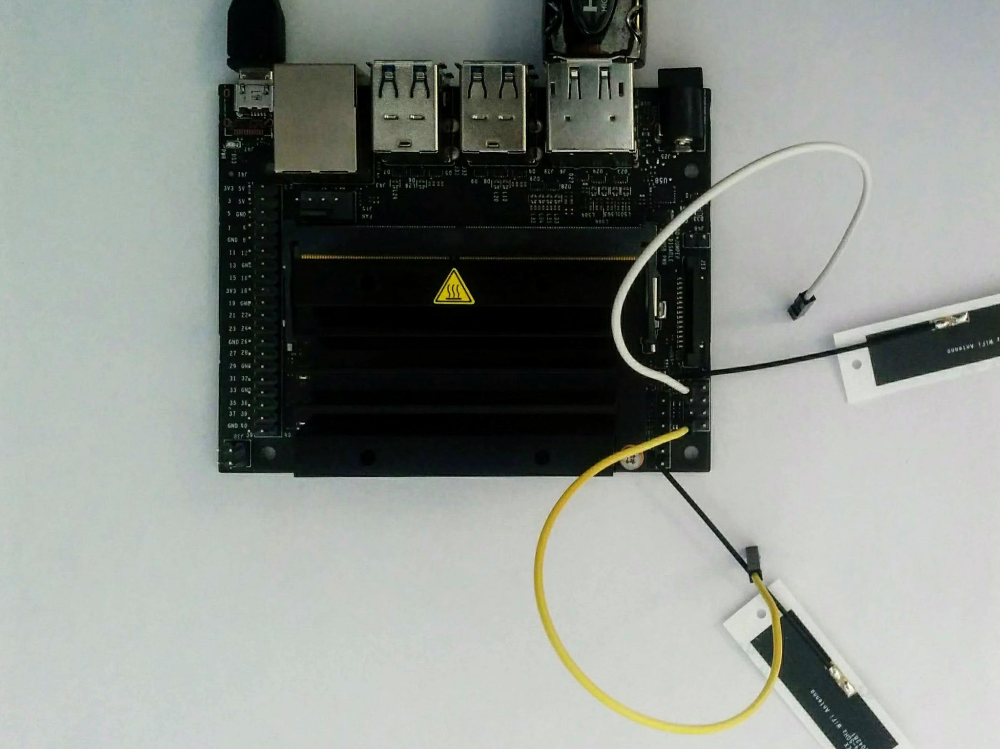
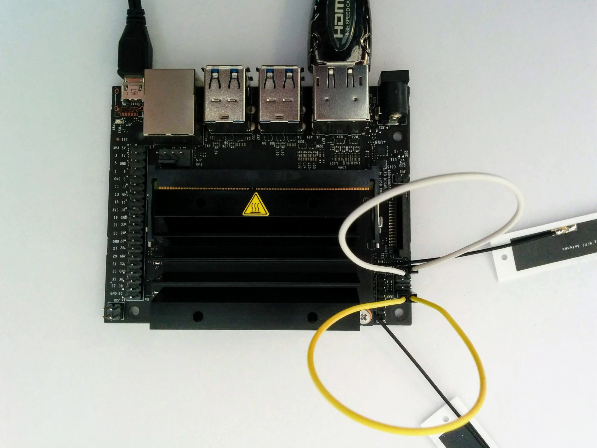
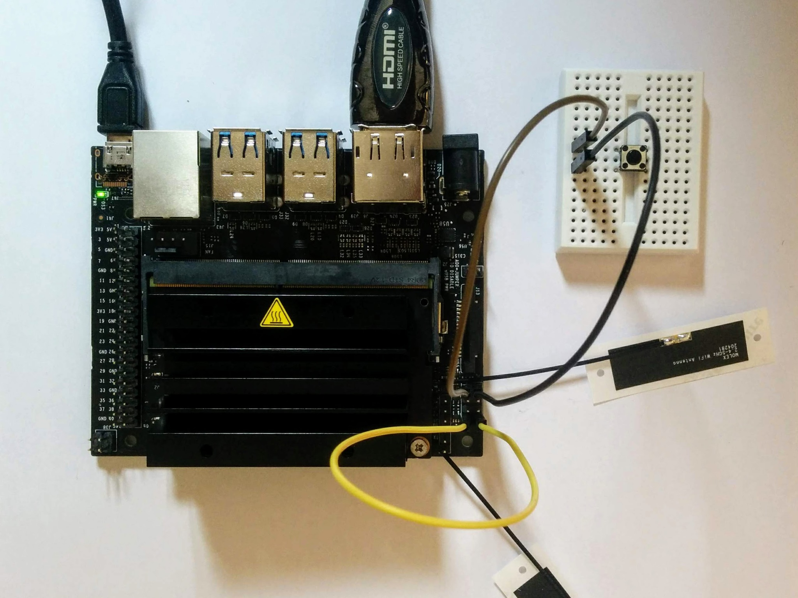

Jetson Nano power management
============================

The 8 pin J40 header block exposes some of the power management related signals.

The interesting pins here are pins 7 and 8 (the `LATCH_SET_BTN` pins), which are connected by a yellow jumper cable in the pictures below, and pins 1 and 2 (the `BUTTON_PWR_ON` pins), which are connected by a white jumper cable.

Normally when you connect the USB power cable the board boots-up straigh away. Connecting pins 7 and 8 disables this behavior and instead lets us use pins 1 and 2 to initiate booting.

Pins 1 and 2 will be left unconnected most of the time - so before connecting the USB power cable, unplug one of the two as shown:

Then connect the USB power cable - nothing happens - unlike before the system does not automatically boot up.

Now connect pins 1 and 2 momentarily, i.e. plug in the jumper cable as shown and immediately disconnect it again. In a more permanent setup you'd connect these two pins with a [momentary button switch](https://www.adafruit.com/product/367) (as shown later).

Even though dusty_nv makes it clear in [this post](https://devtalk.nvidia.com/default/topic/1050888/jetson-nano/power-and-suspend-buttons-for-jetson-nano/) that you should only momentarily connect pins 1 and 2, it was this that confused me initially - leaving 1 and 2 connected, rather than connecting and immediately disconnecting them, resulted in confusing behavior.

Shutdown
--------

So momentarily connecting pins 1 and 2 causes the system to boot up. What happens if you momentarily connect pins 1 and 2 once the system is up and running?

It causes the system to shutdown. This is safe, it does **not** cause a hard shutdown, it's essentially a hardware initiated `shutdown now`. The system does not power off immediately, instead it goes thru a normal orderly shutdown sequence.

Restart
-------

Once the system is shutdown you can restart it by again momentarily connecting pins 1 and 2. This is exactly the behavior I was looking for when I first [asked about this](https://devtalk.nvidia.com/default/topic/1051378/jetson-nano/jetson-nano-wake-from-shutdown-poweroff-functionality-/) on the Nvidia forums. I.e. I wanted to restart the system without having to disconnect and reconnect the USB power cable.

Shutdown only behavior
----------------------

So do pins 1 and 2 do anything if you don't have pins 7 and 8 connected together all the time as above?

Yes - when pins 7 and 8 are not connected pins 1 and 2 will do nothing when the system is in a powered off state but when the system is up and running momentarily connecting them will still trigger an orderly shutown of the system.

Breadboard layout
-----------------

To avoid accidentally connecting the wrong pins together (with potentially very serious consequences) a longer term solution is to wire pins 1 and 2 together via a push button like so:

References
----------

* My [original thread](https://devtalk.nvidia.com/default/topic/1051378/jetson-nano/jetson-nano-wake-from-shutdown-poweroff-functionality-/) on the Nvidia forums - where jonnymovo pointed me to the right answer.
* The [thread](https://devtalk.nvidia.com/default/topic/1050888/jetson-nano/power-and-suspend-buttons-for-jetson-nano/) pointed to by jonnymovo that explains the J40 header.
* The [Jetson Nano developer kit user guide](https://developer.nvidia.com/embedded/dlc/jetson-nano-dev-kit-user-guide) that covers all the headers on the development board (including J40).
* The datasheet for Jetson Nano system-on-module includes more details on the actual underlying module pins that the J40 header exposes (the final datasheet is not yet available but you can find preliminary versions via Google).
