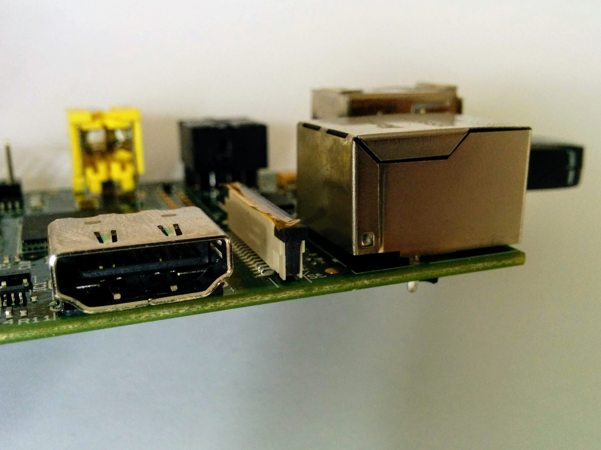
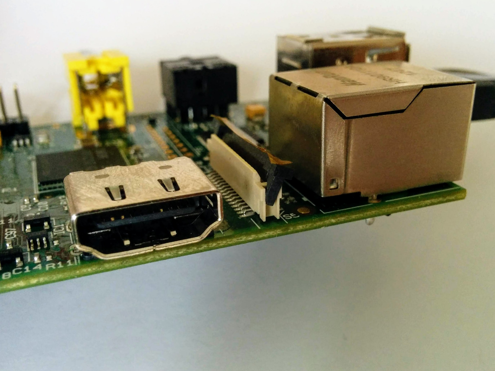
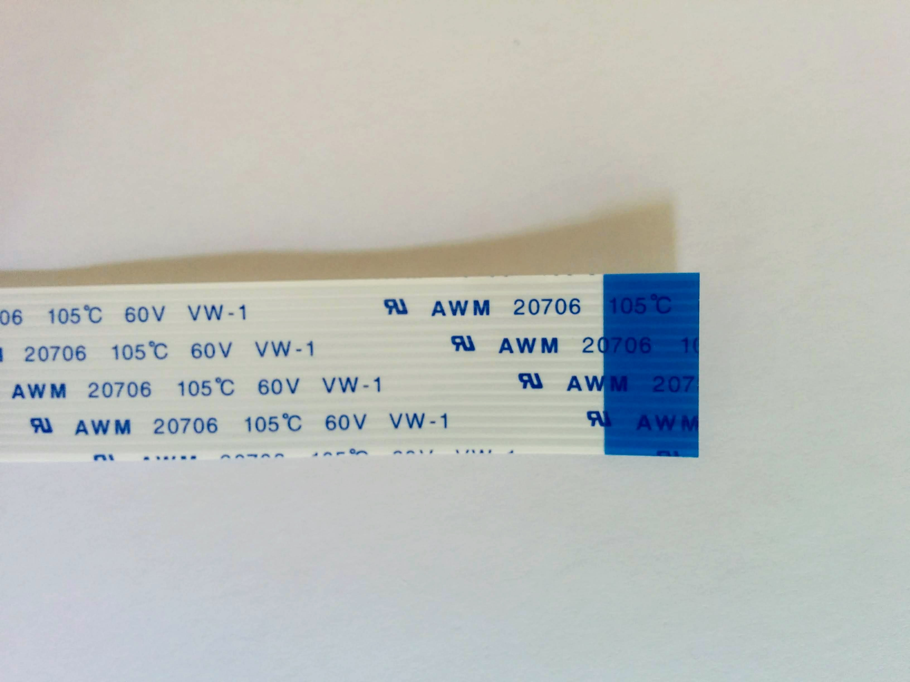
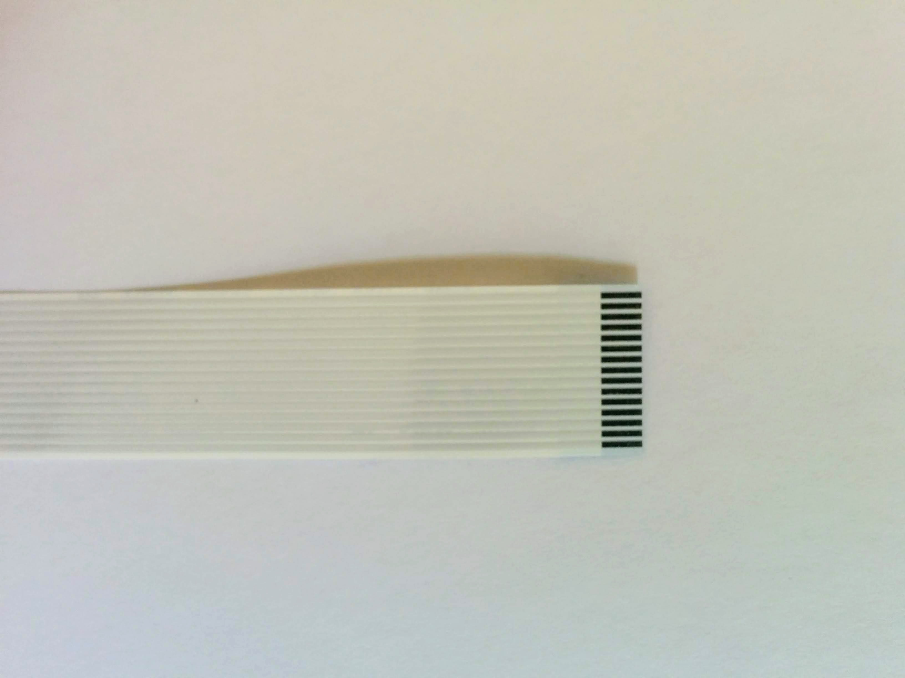
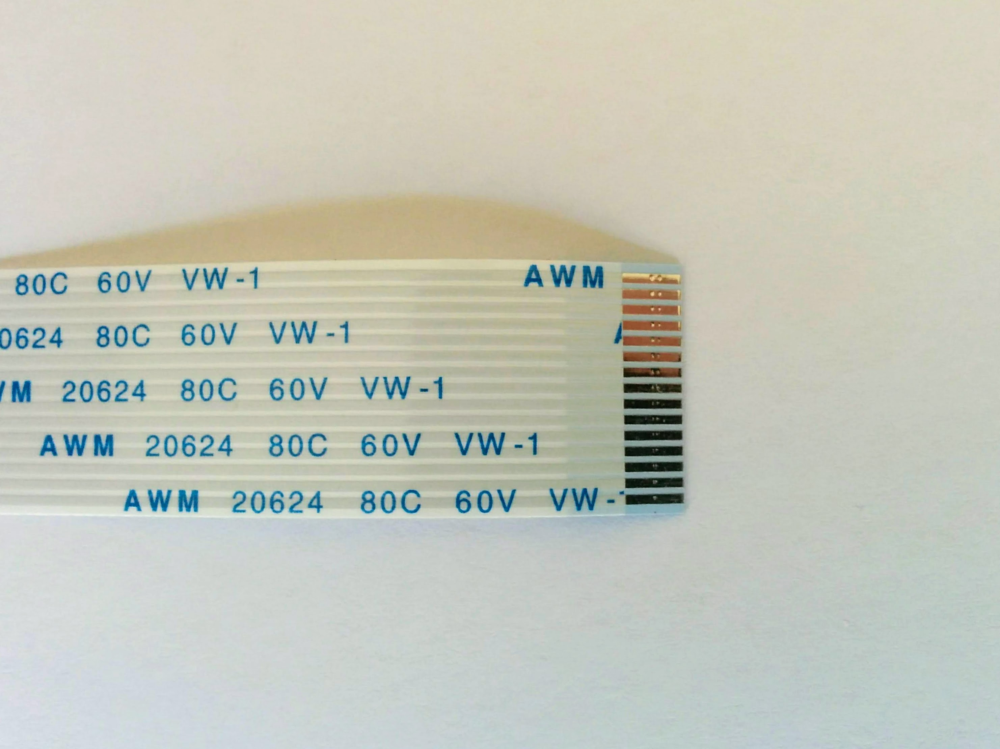
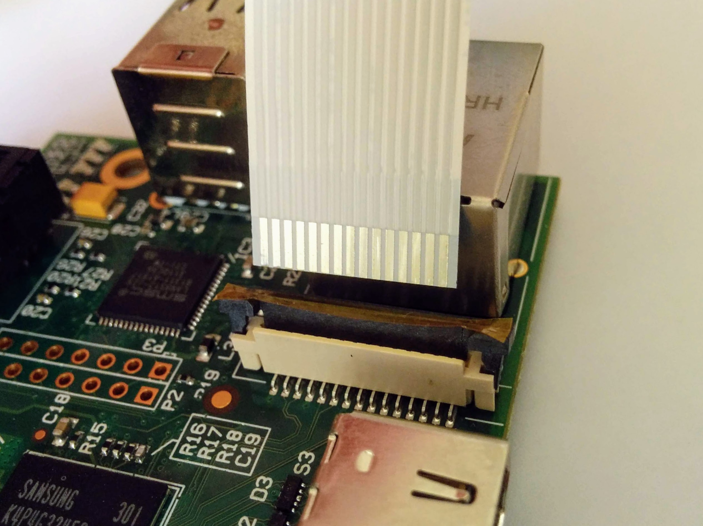
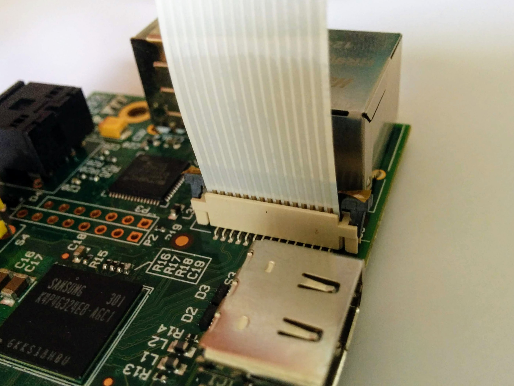
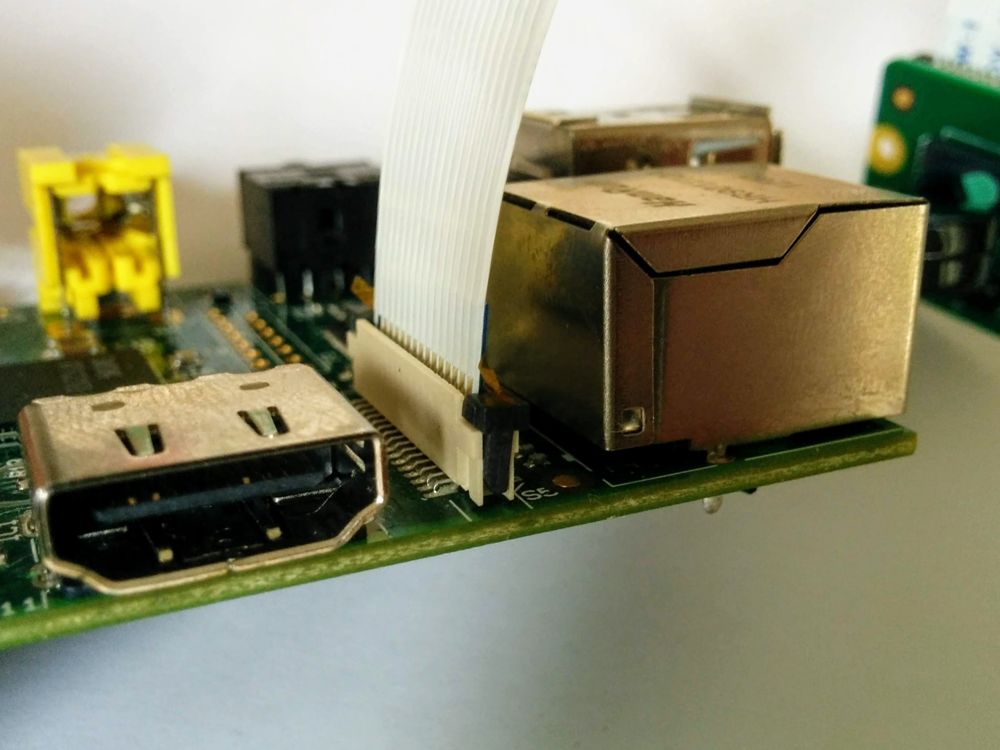
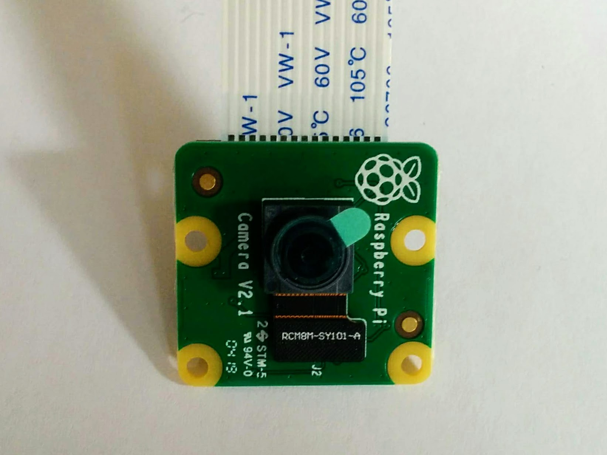

Connecting the camera module
============================

One of the camera connectors is between the ethernet port and the HDMI connector - we'll use that one.

The connector has a latch at the top.

Pull up the latch and push it backwards (it can only be pushed one direction - let's call that back).

The important thing is to put the camera cable in the right way around. One side of the end of the cable is colored blue.

The other side of the cable has silvery connectors at the end.

The text on the cable is unimportant, I have one camera where the text is on the side with the silvery connectors and one where it's on the other side.

Insert the cable so that the silvery connectors are facing forward, away from the latch that you just pulled up and back.

Once the cable is inserted push the latch back into place.

Once all this is done remove the protective film (see the little green tab) that's there to protect the camera lens before use.

